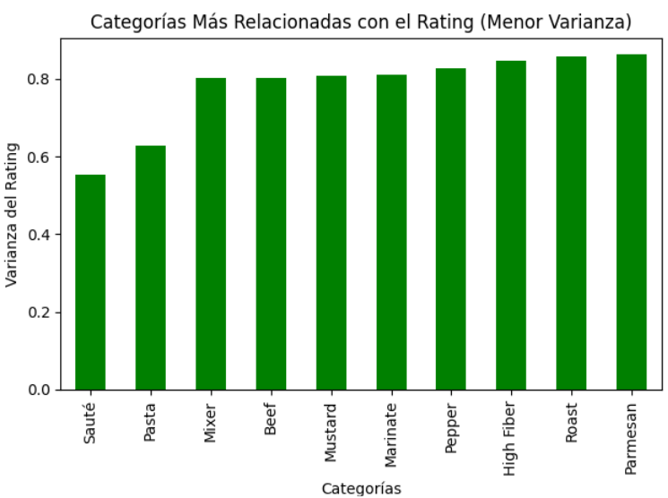
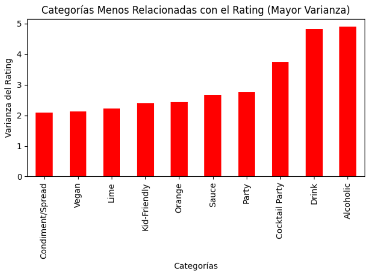
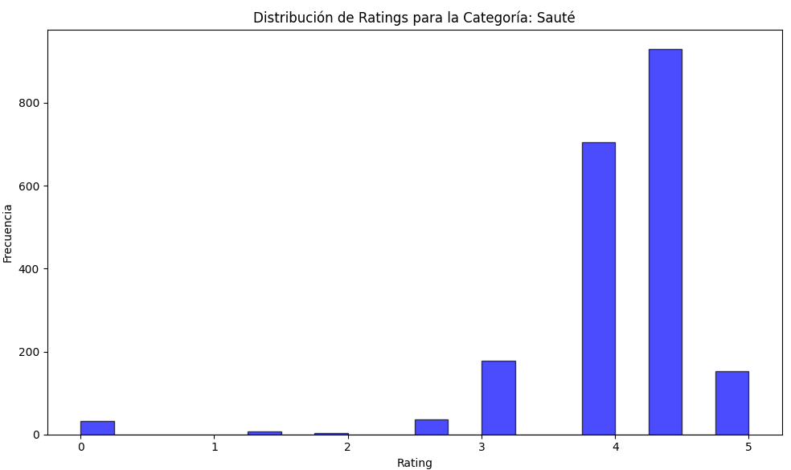
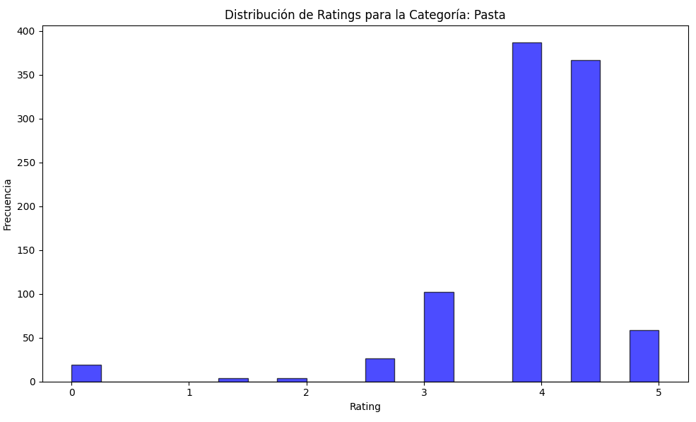
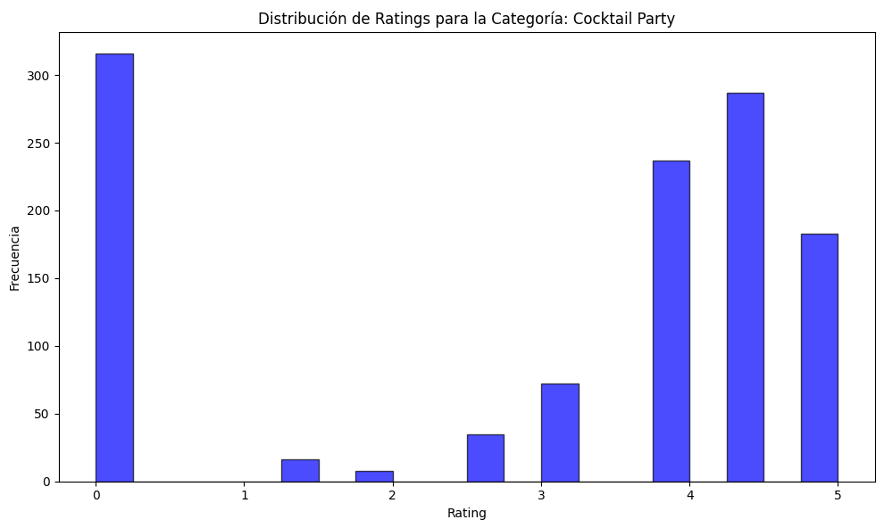
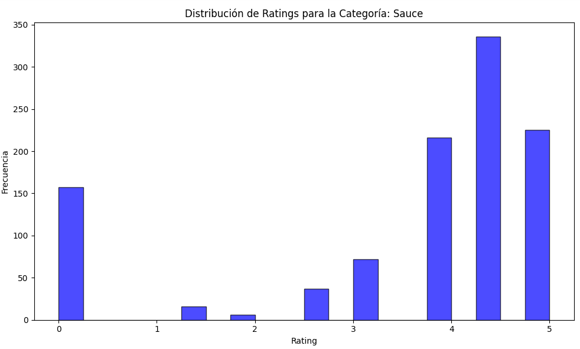

  Proyecto Final
  
  Tratamiento de Datos
  
  Máster de Ing. de Telecomunicación

  Daniel Muñoz y Marina Rello
  

El proyecto básico consistirá en la resolución de una tarea de regresión, comparando las prestaciones obtenidas al utilizar distintas vectorizaciones de los documentos y al menos dos estrategias distintas de aprendizaje automático, según se describe a continuación. Los pasos que debe seguir en su trabajo son los siguientes:

# 1. Análisis de variables de entrada. Visualice la relación entre la variable de salida y algunas de las categorías en la variable categories y explique su potencial relevancia en el problema.
En este paso, se ha realizado un análisis exploratorio de la base de datos para identificar posibles relaciones entre las distintas categorías y el rating. Para ello, se ha calculado la varianza de los ratings asociados a cada categoría como medida de dispersión: una varianza baja indica que la categoría está más consistentemente asociada a ciertos valores de rating, mientras que una varianza alta sugiere una relación menos definida.

Con el fin de garantizar la fiabilidad del análisis, este estudio se ha limitado a las categorías que aparecen al menos 500 veces en la base de datos. Esto evita sesgos provocados por la baja frecuencia de algunas categorías. Finalmente, se han identificado las categorías con la mayor y menor relación con el rating, basándose en sus respectivas varianzas, y se han visualizado mediante histogramas las distribuciones de rating para cada una de ellas.

Entre las categorías más relacionadas con el rating, destacan Sauté, Pasta y Mixer, con varianzas de 0.553, 0.628 y 0.802 respectivamente. Esto indica que las recetas asociadas a estas categorías tienden a tener valores de rating más uniformes. Por otro lado, las categorías menos relacionadas con el rating incluyen Alcoholic, Drink y Cocktail Party, que presentan varianzas de 4.910, 4.831 y 3.742 respectivamente, mostrando distribuciones de rating mucho más dispersas.

Esto se puede observar en las gráficas adjuntas: la primera muestra las 10 categorías con menor varianza, es decir, las más relacionadas con el rating, mientras que la segunda presenta las categorías con mayor varianza, reflejando una relación menos definida con los ratings. Este análisis aporta información valiosa sobre qué categorías pueden tener un impacto más predecible en los ratings y cuáles presentan una relación más heterogénea.

  
  

A continuación se muestran los histogramas de ratings para algunas de las categorías más relacionadas con el rating:

  
  

A partir de los histogramas mostrados, se puede observar que los ratings para las categorías como Sauté y Pasta son mayoritariamente positivos, concentrándose principalmente en valores altos (4 y 5). Esto indica que estas categorías están consistentemente asociadas con recetas que los usuarios valoran positivamente, evidenciando una relación clara y fuerte con los ratings. La baja dispersión en los valores de rating refuerza esta conclusión.  

A continuación se muestran los histogramas de ratings para algunas de las categorías menos relacionadas con el rating:

  
  

A partir de los histogramas mostrados, se puede observar que los ratings para estas categorías están distribuidos de manera más uniforme entre puntuaciones distintas, desde 1 hasta 5. Esto sugiere que no existe una relación clara entre estas categorías y el rating, ya que los valores están dispersos y no muestran una concentración significativa en puntuaciones específicas.

# 2. Implementación de un pipeline para el preprocesado de los textos. Para esta tarea puede usar las librerías habituales (NLTK, Gensim o SpaCy), o cualquier otra librería que considere oportuna. Tenga en cuenta que para trabajar con transformers el texto se pasa sin preprocesar.

# 3. Representación vectorial de los documentos mediante tres procedimientos diferentes:
## - TF-IDF
## - Word2Vec(es decir, la representación de los documentos como promedio de los embeddings de las palabras que lo forman)
## - Embeddings contextuales calculados a partir de modelos basados en transformers (e.g., BERT, RoBERTa, etc).

# 4. Entrenamiento y evaluación de modelos de regresión utilizando al menos las dos estrategias siguientes de aprendizaje automático:
## - Redes neuronales utilizando PyTorch para su implementación.
## - Al menos otra técnica implementada en la librería Scikit-learn (e.g., K-NN, SVM, Random Forest, etc)

# 5. Comparación de lo obtenido en el paso 3 con el fine-tuning de un modelo preentrenado con Hugging Face. En este paso se pide utilizar un modelo de tipo transformer con una cabeza dedicada a la tarea de regresión.

