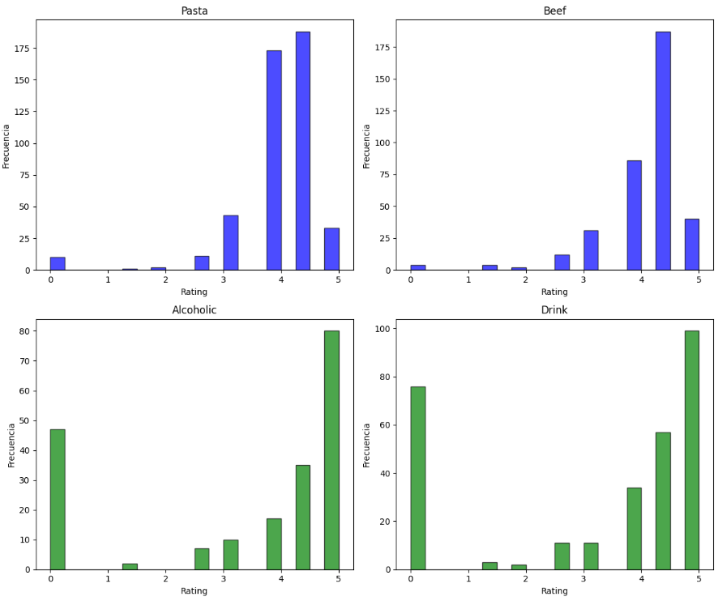
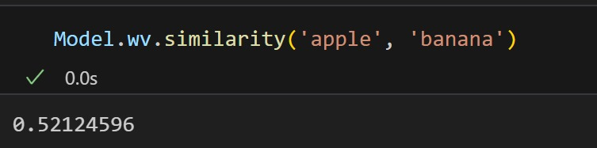
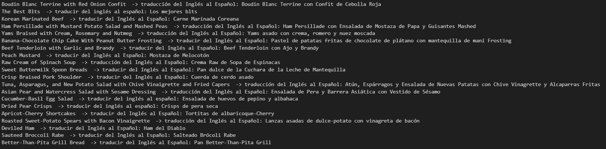

  
  **Proyecto Final** 
  
  **Tratamiento de Datos**
  
  **Máster de Ing. de Telecomunicación**

  **Daniel Muñoz y Marina Rello**
  

El proyecto básico consistirá en la resolución de una tarea de regresión, comparando las prestaciones obtenidas al utilizar distintas vectorizaciones de los documentos y al menos dos estrategias distintas de aprendizaje automático, según se describe a continuación. Los pasos que debe seguir en su trabajo son los siguientes:

Como paso inicial, observamos el dataset con el que se va a trabajar:

  

Se observan valores vacíos en el dataset, por lo que se realiza una limpieza del mismo eliminando estos valores vacíos.

Una vez eliminados los valores vacíos del dataset, observamos los valores numéricos del dataset, con el fin de entender mejor la información contenida:

  

En cada histograma, los valores en el eje horizontal son extremadamente grandes, pero la mayor parte de los datos se concentran cerca de un rango más pequeño (cercano a cero). Esto sugiere que hay valores muy grandes (outliers) que "alargan" el eje y distorsionan la visualización de la distribución principal. 

Se ha realizado una limpieza de dichos "outliers", tras la limpieza, volvemos a observamos los valores numéricos del dataset. Los valores extremos (outliers) que antes estiraban las escalas de los ejes han sido eliminados. Ahora las distribuciones muestran de forma más clara y representativa cómo se concentran los datos:

  

# 1. Análisis de variables de entrada. Visualice la relación entre la variable de salida y algunas de las categorías en la variable categories y explique su potencial relevancia en el problema.

Como paso previo, se ha estudiado la relación de las distintas variables numéricas con el "rating":

  

Se han realizado gráficos de dispersión para analizar la relación entre las variables numéricas (fat, calories, protein y sodium) y el rating. Al observar los resultados, se puede concluir que no existe una relación clara o significativa, ya que los puntos se encuentran dispersos y no muestran patrones definidos. La variabilidad del "rating" se mantiene amplia para todos los valores de las variables numéricas, lo que indica que estas no tienen un impacto directo en el comportamiento del rating.

En el análisis de las variables de entrada, se ha explorado la relación entre la variable de salida rating y algunas categorías de la columna categories.
Se han ido probando distintas categorías de la variable categories para analizar su relación con la variable de salida rating, encontrando resultados contrastantes. Por ejemplo, las categorías "Pasta" y "Beef" muestran una mayor concentración de ratings en valores altos, especialmente entre 4 y 5, lo que sugiere una ligera relación positiva con el rating, ya que las recetas pertenecientes a estas categorías tienden a ser mejor valoradas. En cambio, otras categorías como "Alcoholic" y "Drink" presentan una distribución de ratings mucho más dispersa, con valores repartidos en todo el rango, lo que indica que no tienen una relación clara con la variable de salida.

  

# 2. Implementación de un pipeline para el preprocesado de los textos. Para esta tarea puede usar las librerías habituales (NLTK, Gensim o SpaCy), o cualquier otra librería que considere oportuna. Tenga en cuenta que para trabajar con transformers el texto se pasa sin preprocesar.

En este paso se han transformado los datos de entrada de texto en bruto en una representación vectorial. Para ello, se ha eliminado la información irrelevante de los datos de texto, preservando la mayor cantidad de información relevante posible para capturar el contenido semántico en la colección de documentos.
Para ello se han realizado los siguientes pasos:
  - Tokenization: Se ha dividido el texto en unidades más pequeñas llamadas tokens, para poder trabajar con cada elemento del texto de manera independiente.
  - Homogeneization: Se estandariza el texto para reducir variaciones innecesarias, como convertir todo a minúsculas, eliminar acentos y elementos no alfanuméricos o normalizar términos similares.
  - Cleaning: se han eliminado aquellas palabras que son muy comunes en el idioma y no aportan contenido semántico útil 
  - Vectorization: Se ha transformado el texto procesado en una representación numérica (vectores) que los algoritmos pueden interpretar. Estos vectores capturan la información semántica y estructural del texto. Para ello, se ha creado un diccionario que asocia cada token con un identificador único y se han eliminado palabras que aparecen en muy pocos documentos o en demasiados. Cada documento se convierte en una lista de tuplas incluyendo el identificador único del token y la cantidad de veces que ese token aparece en el documento. Esto produce una representación dispersa (sparse vector), donde las palabras relevantes del texto están asociadas con su frecuencia. Finalmente, cada documento se representa como un vector disperso, donde los identificadores de los tokens corresponden a posiciones específicas del vector, y los valores representan la frecuencia.

Por último vamos a crear un diccionario para cada una de las columnas ya preprocesadas, y una vez creado realizaremos una limpieza para eliminar las palabras del diccionario que aparezcan en mas del 80% de recetas y en menos de 5 documentos.Terminaremos realizando un Bag of Words (BoW) para las columnas preprocesadas del dataframe, de esta manera habremos realizado una vectorización simple de nustro texto.

# 3. Representación vectorial de los documentos mediante tres procedimientos diferentes:
Una vez conseguido nustras columnas de texto ya preprocesadas en el paso anterior, podremos proceder con la vectoriazion de estas columnas con distintos modelos.
## - TF-IDF
Comenzaremos con la vectorización mediante TF-IDF. Para ello empleamos el modelo TfidfVectorizer el caul aprende el vocabulario y su importancia mediante un fit, y a continuación realiza una transformacion de los textos en vectores mediante un transform. Obtedremos una matriz en la que veremos la representacion de cada palabra de una receta con su puntuaje de TF-IDF.
Realizamos estos pasos con cada una de las columnas de texto que tenemos.

## - Word2Vec(es decir, la representación de los documentos como promedio de los embeddings de las palabras que lo forman)
Para la vectorizacion de las columnas de texto empleando Word2Vec que consiste en caprturar las relaciones semánticas y sintácticas entre palabras.
En primer lugar deberemos de entrenar nuestro modelo sobre la columna de texto ya preprocesada a vectorizar. Al entrenar el modelo hemos empleado los siguientes parametros:
min_count=1 para incluir las palabras que aparecen al menos una vez, vector_size=100 para que cada palabra sea representada mediante un vector de 100 dimensiones y por último workers=4 donde indicamos el número de hilos a emplear para el entrenamiento del modelo.
Finalmente añadimos a nuestro dataframe en unas columnas nuevas los vectores obtenidos mediante la vectorización de W2V.

  

## - Embeddings contextuales calculados a partir de modelos basados en transformers (e.g., BERT, RoBERTa, etc).
Por último realizaremos la vectorización de las columnas de texto de nuestro dataframe empleando un modelo preentrenado de BERT ('bert-base-uncased') para generar los embeddings, colocaremos el el modelo en modo evaluacion para desactivas su entrenamiento y evitar asi cambios en los pesos.
En primer lugar deberemos de recorrer cada fila de las columnas de texto y colocar las etiquetas "CLS" y "SEP" al inicio y al final de cada frase que tengamos, para el correcto funcionamiento de nuestro modelo. Hay que tener en cuenta que nuestrotexto tkenizado no puede tener un tamaño superior a 512 por lo que trataremos nuestros datos para que esto no llegue a ocurrir.
Una vez tokenizado nuestro código mapearemos los tokens a índices del vocabulario de BERT.
Para finalizar con la vectorización, crearemos los tensores para los tokens y para los segmentos que se utilizaran en BERT para identificar si los tokens pertenecen a una o dos frases diferentes.
Finalmente añadiremos al dataframe en nuevas columnas los vectores obtenidos para cada receta.

# 4. Entrenamiento y evaluación de modelos de regresión utilizando al menos las dos estrategias siguientes de aprendizaje automático:
Cada modelo de regresión ha sido entrenado y evaluado utilizando las tres técnicas de vectorización presentadas en el apartado anterior, con el objetivo de comparar los resultados obtenidos y determinar cuál de las técnicas ofrece el mejor rendimiento.

En primer lugar, se llevó a cabo una regresión utilizando el modelo k-NN con la vectorización Word2Vec. Para ello, se probó el modelo empleando diferentes combinaciones de columnas como entrada (𝑋), con el propósito de identificar cuáles ofrecían los mejores resultados. Una vez determinada la combinación óptima, esta se utilizó de manera uniforme en todos los modelos para garantizar la coherencia en la comparación.

La tabla que se presenta a continuación muestra las distintas combinaciones de columnas evaluadas y los valores de error cuadrático medio (MSE) obtenidos en cada caso.

| **Combinación de Columnas**                                                  | **MSE (k-NN)** |
|------------------------------------------------------------------------------|---------------:|
| directions_W2V, otras_columnas, categories_W2V, desc_W2V, title_W2V, ingredients_W2V | 1.55          |
| directions_W2V, otras_columnas, categories_W2V, desc_W2V                     | 1.55          |
| directions_W2V, otras_columnas, categories_W2V, title_W2V                    | 1.55          |
| directions_W2V, otras_columnas, categories_W2V                               | 1.55          |
| directions_W2V, categories_W2V, title_W2V                                    | 1.49          |
| directions_W2V, categories_W2V, desc_W2V, title_W2V, ingredients_W2V         | 1.49          |
| directions_W2V, categories_W2V, desc_W2V, title_W2V                          | 1.47          |

Durante este análisis, se observó que las combinaciones que incluían columnas de valores numéricos producían peores resultados, por lo que dichas columnas fueron excluidas de la entrada del modelo. Finalmente, la combinación que ofreció los mejores resultados incluye las columnas: directions, categories, desc y title.

## - Redes neuronales utilizando PyTorch para su implementación.
Se ha implementado una red neuronal diseñada con dos capas ocultas: la primera con 50 neuronas y la segunda con 25, ambas utilizando la función de activación ReLU, y una capa de salida con una única neurona para predecir valores continuos. Se divide el conjunto de datos en entrenamiento (80%) y prueba (20%), convirtiendo los datos a tensores para su uso en PyTorch. La red se entrena durante 25 épocas usando el optimizador Adam y la función de pérdida de error cuadrático medio (MSELoss), procesando los datos en lotes de 32 muestras con un DataLoader para mejorar la eficiencia. Finalmente, se evalúa el modelo en los datos de prueba calculando la pérdida y el coeficiente R2.

## - Al menos otra técnica implementada en la librería Scikit-learn (e.g., K-NN, SVM, Random Forest, etc)
Se han implementado los modelos de regresión k-NN y Random Forest. 
Para el modelo k-NN, se ha realizado validación cruzada en cada vectorización con el objetivo de determinar el valor óptimo del hiperparámetro 𝑘. 
En el caso de Random Forest, debido a las limitaciones de tiempo y al elevado costo computacional, el ajuste de los hiperparámetros "n_estimators" y "max_depth" se ha realizado únicamente para una de las vectorizaciones, utilizando los valores obtenidos como referencia para el resto de los modelos.

A continuación, se presenta una tabla comparativa que recoge los resultados obtenidos para cada modelo de regresión aplicado a las diferentes técnicas de vectorización.

<table>
    <tr>
        <th>Modelo</th>
        <th>Vectorización</th>
        <th>MSE</th>
        <th>MAE</th>
        <th>R²</th>
        <th>RMSE</th>
    </tr>
    <tr>
        <td rowspan="3">k-NN</td>
        <td>TF-IDF</td>
        <td>1.436</td>
        <td>0.807</td>
        <td>1.198</td>
        <td>0.069</td>
    </tr>
    <tr>
        <td>Word2Vec</td>
        <td>1.518</td>
        <td>0.822</td>
        <td>1.232</td>
        <td>0.016</td>
    </tr>
    <tr>
        <td>BERT</td>
        <td>1.518</td>
        <td>0.822</td>
        <td>1.232</td>
        <td>0.016</td>
    </tr>
    <tr>
        <td rowspan="3">Random Forest</td>
        <td>TF-IDF</td>
        <td>1.387</td>
        <td>0.794</td>
        <td>1.178</td>
        <td>0.101</td>
    </tr>
    <tr>
        <td>Word2Vec</td>
        <td>1.413</td>
        <td>0.801</td>
        <td>1.189</td>
        <td>0.084</td>
    </tr>
    <tr>
        <td>BERT</td>
        <td>1.61</td>
        <td>0.83</td>
        <td>0.044</td>
        <td>1.27</td>
    </tr>
    <tr>
        <td rowspan="3">Red Neuronal</td>
        <td>TF-IDF</td>
        <td>1.524</td>
        <td>X</td>
        <td>0.043</td>
        <td>X</td>
    </tr>
    <tr>
        <td>Word2Vec</td>
        <td>1.585</td>
        <td>X</td>
        <td>0.004</td>
        <td>X</td>
    </tr>
    <tr>
        <td>BERT</td>
        <td>1.67</td>
        <td>X</td>
        <td>-0.05</td>
        <td>X</td>
    </tr>
</table>

Observamos que la vectorización que mejores resultados obtiene en los tres modelos de regresion es TF-IDF, y que el mejor resultado se obtiene con Random Forest.

# 5. Comparación de lo obtenido en el paso 3 con el fine-tuning de un modelo preentrenado con Hugging Face. En este paso se pide utilizar un modelo de tipo transformer con una cabeza dedicada a la tarea de regresión.
En este punto entrenaremos y evaluaremos un modelo BERT.
Para el entrenamiento hemos establecido la columna de descripciones como entrada y la columna de ratings como salida. Comenzaremos dividiendo los datos en un conjunto de entrenamiento(80%) y test(20%). 
Al igual que en el punto 3 empleamos el modelo y el tokenizador de 'bert-base-uncased', y a continuación realizamos una conversión de las listas de texto creadas anteriormente en tokens de BERT, teniendo en cuenta algunas medidas como la longitud maxima de este token y el relleno de estos para que todos sean de la misma longitud.

De cara al entrenamiento del modelo primeramente configuramos los argumentos a emplear para el entrenamiento, como por ejemplo directorio donde guardaremos los resultados del modelo,el número de epochs a emplear (1), o también la frecuencia de registro de métricas.
Por ultimo realizaremos el entrenamiento y la evaluación del modelo y nos lo guardaremos en local para su posterior uso.

Una vez ya tenemos nuestro modelo entrenado y evaluado,podemos seguir los mismos pasos que en el apartado 3, para realizar la vectorizacion medainte BERT de nuestras columnas de texto. El único cambio que deberemos de realizar es cambiar el tokenizer y el modelo y sustituir el que empleabamos en el apartado 3 por nuestro nuevo modelo entrenado.

Para la comparación de resultados entre los dos modelos de BERT realizaremos los mismos pasos con ambos modelos. Analizaremos los resultados del MSE, MAE, RMSE y R^2 de la  red neuronal, y los modelos de regreión KNN y Random Forest.
Los resultados obtrenidos se pueden apreciar en la siguiente tabla:

| Modelo BERT       | Modelo de Regresión |    MSE    |    MAE    |   RMSE   |     R²    |
|:-----------------:|:-------------------:|:---------:|:---------:|:--------:|:---------:|
| BERT-Modelo 1     | KNN                |   1.51   |   0.822   |  1.23   |   0.016    |
|                   | Random Forest      |  1.61   |   0.83   |  1.27  |   0.044    |
|                   | Red Neuronal       |   1.67   |   X   | X   |   -0.05    |
| BERT-Modelo 2     | KNN                |   1.48   |   0.77   |  1.22   |   0.04    |
|                   | Random Forest      |   1.39   |   0.79   |  1.18   |   0.09    |
|                   | Red Neuronal       |   1.52   |   X   |  X  |  0.04    |

Se puede apreciar que con nuestro nuevo modelo hemos conseguido unos resultados ligeramente mejores.

# EXTENSIÓN
En la extensión se ha realizado una tarea de traducción de texto.
Se ha utilizado la librería Hugging Face Transformers para traducir automáticamente los títulos de la columna title del inglés al español, empleando el modelo pre-entrenado Helsinki-NLP/opus-mt-en-es. Primero, se configura un pipeline para realizar la tarea de generación de texto orientada a la traducción. Luego, se recorre cada título en la columna y se pasa al modelo un comando explícito para traducir, como "translate from English to Spanish: {title}". El modelo genera el texto traducido, que se extrae y almacena en una lista. Finalmente, esta lista de traducciones se agrega como una nueva columna, title_translated, en el DataFrame original, permitiendo tener tanto los títulos originales como sus traducciones.

En la imagen de abajo se muestra el resultado de una ejecución realizada para mostrar las columnas "Title" y "Title_translated", para comprobar el correcto funcionamiento:

  

# RECUSROS UTILIZADOS

[1] https://www.youtube.com/watch?v=ATK6fm3cYfI
[2]https://github.com/ML4DS/ML4all/blob/master/B5_NLP/TM1.IntrodNLP/NLP_py3_NSF/notebook/NLPintro_professor.ipynb 
[3] [https://www.youtube.com/watch?v=scnxktbxYv8](https://www.youtube.com/watch?v=ZjaMvO3VEdU&t=360s)
[4]https://github.com/marvin2311/NN_Projects/blob/main/house_prices_ANN.ipynb 
[5]https://github.com/ML4DS/ML4all/blob/master/B2_regression/R2.kNN_Regression/regression_knn_professor.ipynb 
[6] 

