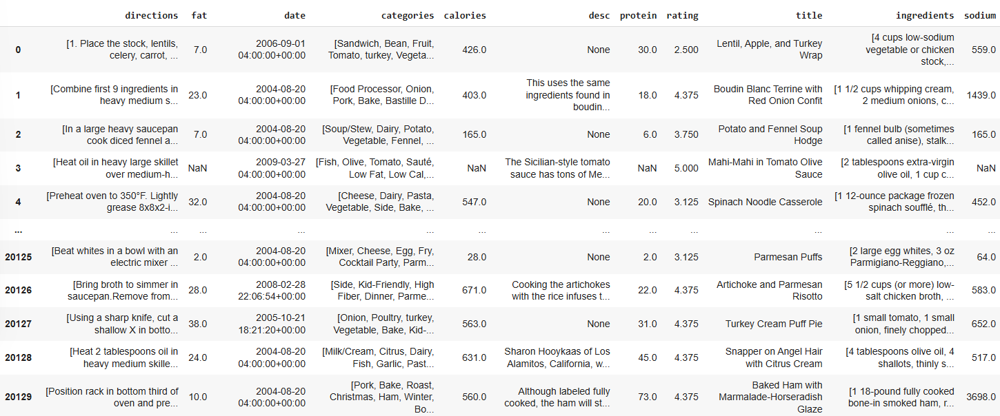
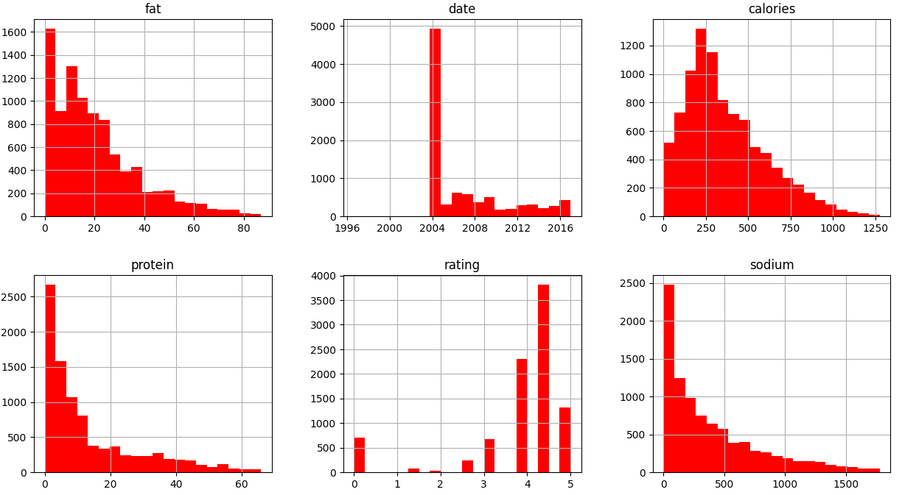
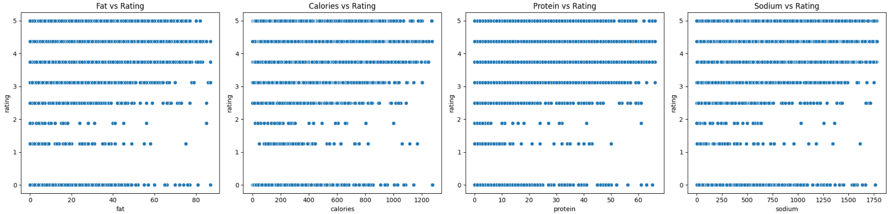
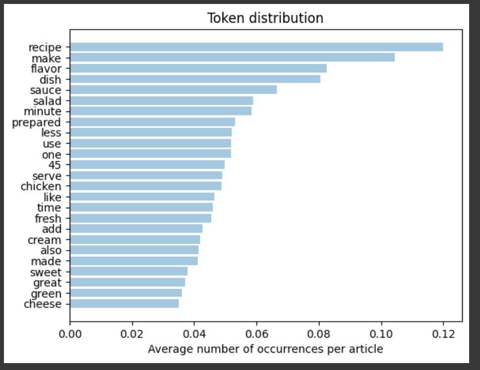
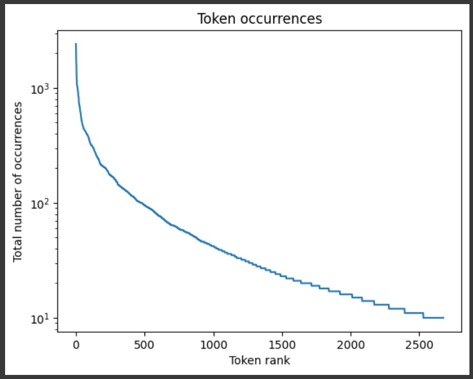

  Proyecto Final
  
  Tratamiento de Datos
  
  Máster de Ing. de Telecomunicación

  Daniel Muñoz y Marina Rello
  

El proyecto básico consistirá en la resolución de una tarea de regresión, comparando las prestaciones obtenidas al utilizar distintas vectorizaciones de los documentos y al menos dos estrategias distintas de aprendizaje automático, según se describe a continuación. Los pasos que debe seguir en su trabajo son los siguientes:

Como paso inicial, observamos el dataset con el que se va a trabajar:

  

Se observan valores vacíos en el dataset, por lo que se realiza una limpieza del mismo eliminando estos valores vacíos.

Una vez eliminados los valores vacíos del dataset, observamos los valores numéricos del dataset, con el fin de entender mejor la información contenida:

  

En cada histograma, los valores en el eje horizontal son extremadamente grandes, pero la mayor parte de los datos se concentran cerca de un rango más pequeño (cercano a cero). Esto sugiere que hay valores muy grandes (outliers) que "alargan" el eje y distorsionan la visualización de la distribución principal. 

Se ha realizado una limpieza de dichos "outliers", tras la limpieza, volvemos a observamos los valores numéricos del dataset. Los valores extremos (outliers) que antes estiraban las escalas de los ejes han sido eliminados. Ahora las distribuciones muestran de forma más clara y representativa cómo se concentran los datos:

  

# 1. Análisis de variables de entrada. Visualice la relación entre la variable de salida y algunas de las categorías en la variable categories y explique su potencial relevancia en el problema.

Como paso previo, se ha estudiado la relación de las distintas variables numéricas con el "rating":

  

Se han realizado gráficos de dispersión para analizar la relación entre las variables numéricas (fat, calories, protein y sodium) y el rating. Al observar los resultados, se puede concluir que no existe una relación clara o significativa, ya que los puntos se encuentran dispersos y no muestran patrones definidos. La variabilidad del "rating" se mantiene amplia para todos los valores de las variables numéricas, lo que indica que estas no tienen un impacto directo en el comportamiento del rating.

En el análisis de las variables de entrada, se ha explorado la relación entre la variable de salida rating y algunas categorías de la columna categories.
Se han ido probando distintas categorías de la variable categories para analizar su relación con la variable de salida rating, encontrando resultados contrastantes. Por ejemplo, las categorías "Pasta" y "Beef" muestran una mayor concentración de ratings en valores altos, especialmente entre 4 y 5, lo que sugiere una ligera relación positiva con el rating, ya que las recetas pertenecientes a estas categorías tienden a ser mejor valoradas. En cambio, otras categorías como "Alcoholic" y "Drink" presentan una distribución de ratings mucho más dispersa, con valores repartidos en todo el rango, lo que indica que no tienen una relación clara con la variable de salida.

  

###################################CAMBIAR TODO ESTO###################################

En este paso, se ha realizado un análisis exploratorio de la base de datos para identificar posibles relaciones entre las distintas categorías y el rating. Para ello, se ha calculado la varianza de los ratings asociados a cada categoría como medida de dispersión: una varianza baja indica que la categoría está más consistentemente asociada a ciertos valores de rating, mientras que una varianza alta sugiere una relación menos definida.

Con el fin de garantizar la fiabilidad del análisis, este estudio se ha limitado a las categorías que aparecen al menos 500 veces en la base de datos. Esto evita sesgos provocados por la baja frecuencia de algunas categorías. Finalmente, se han identificado las categorías con la mayor y menor relación con el rating, basándose en sus respectivas varianzas, y se han visualizado mediante histogramas las distribuciones de rating para cada una de ellas.

Entre las categorías más relacionadas con el rating, destacan Sauté, Pasta y Mixer, con varianzas de 0.553, 0.628 y 0.802 respectivamente. Esto indica que las recetas asociadas a estas categorías tienden a tener valores de rating más uniformes. Por otro lado, las categorías menos relacionadas con el rating incluyen Alcoholic, Drink y Cocktail Party, que presentan varianzas de 4.910, 4.831 y 3.742 respectivamente, mostrando distribuciones de rating mucho más dispersas.

Esto se puede observar en las gráficas adjuntas: la primera muestra las 10 categorías con menor varianza, es decir, las más relacionadas con el rating, mientras que la segunda presenta las categorías con mayor varianza, reflejando una relación menos definida con los ratings. Este análisis aporta información valiosa sobre qué categorías pueden tener un impacto más predecible en los ratings y cuáles presentan una relación más heterogénea.

  
  

A continuación se muestran los histogramas de ratings para algunas de las categorías más relacionadas con el rating:

  
  

A partir de los histogramas mostrados, se puede observar que los ratings para las categorías como Sauté y Pasta son mayoritariamente positivos, concentrándose principalmente en valores altos (4 y 5). Esto indica que estas categorías están consistentemente asociadas con recetas que los usuarios valoran positivamente, evidenciando una relación clara y fuerte con los ratings. La baja dispersión en los valores de rating refuerza esta conclusión.  

A continuación se muestran los histogramas de ratings para algunas de las categorías menos relacionadas con el rating:

  
  

A partir de los histogramas mostrados, se puede observar que los ratings para estas categorías están distribuidos de manera más uniforme entre puntuaciones distintas, desde 1 hasta 5. Esto sugiere que no existe una relación clara entre estas categorías y el rating, ya que los valores están dispersos y no muestran una concentración significativa en puntuaciones específicas.

# 2. Implementación de un pipeline para el preprocesado de los textos. Para esta tarea puede usar las librerías habituales (NLTK, Gensim o SpaCy), o cualquier otra librería que considere oportuna. Tenga en cuenta que para trabajar con transformers el texto se pasa sin preprocesar.

En este paso se han transformado los datos de entrada de texto en bruto en una representación vectorial. Para ello, se ha eliminado la información irrelevante de los datos de texto, preservando la mayor cantidad de información relevante posible para capturar el contenido semántico en la colección de documentos.
Para ello se han realizado los siguientes pasos:
  - Tokenization: Se ha dividido el texto en unidades más pequeñas llamadas tokens, para poder trabajar con cada elemento del texto de manera independiente.
  - Homogeneization: Se estandariza el texto para reducir variaciones innecesarias, como convertir todo a minúsculas, eliminar acentos y elementos no alfanuméricos o normalizar términos similares.
  - Cleaning: se han eliminado aquellas palabras que son muy comunes en el idioma y no aportan contenido semántico útil 
  - Vectorization: Se ha transformado el texto procesado en una representación numérica (vectores) que los algoritmos pueden interpretar. Estos vectores capturan la información semántica y estructural del texto. Para ello, se ha creado un diccionario que asocia cada token con un identificador único y se han eliminado palabras que aparecen en muy pocos documentos o en demasiados. Cada documento se convierte en una lista de tuplas incluyendo el identificador único del token y la cantidad de veces que ese token aparece en el documento. Esto produce una representación dispersa (sparse vector), donde las palabras relevantes del texto están asociadas con su frecuencia. Finalmente, cada documento se representa como un vector disperso, donde los identificadores de los tokens corresponden a posiciones específicas del vector, y los valores representan la frecuencia.

A continuación, representamos los términos más frecuentes en el la columna descriptions:

  
  

# 3. Representación vectorial de los documentos mediante tres procedimientos diferentes:
## - TF-IDF
## - Word2Vec(es decir, la representación de los documentos como promedio de los embeddings de las palabras que lo forman)
## - Embeddings contextuales calculados a partir de modelos basados en transformers (e.g., BERT, RoBERTa, etc).

# 4. Entrenamiento y evaluación de modelos de regresión utilizando al menos las dos estrategias siguientes de aprendizaje automático:
## - Redes neuronales utilizando PyTorch para su implementación.
## - Al menos otra técnica implementada en la librería Scikit-learn (e.g., K-NN, SVM, Random Forest, etc)

# 5. Comparación de lo obtenido en el paso 3 con el fine-tuning de un modelo preentrenado con Hugging Face. En este paso se pide utilizar un modelo de tipo transformer con una cabeza dedicada a la tarea de regresión.

